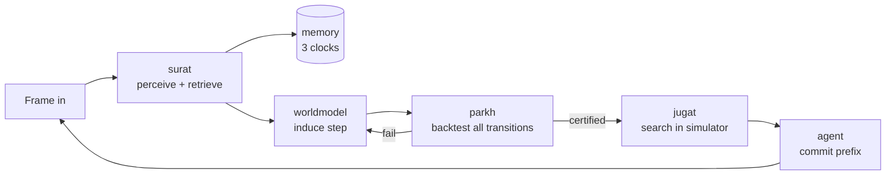

# SARBLOH — Agent Operating Spec

You are working inside SARBLOH, a competition and research repository targeting **ARC-AGI-3** (ARC Prize 2026).
This file is the contract. Read it fully before acting. It is authoritative over anything in `_archive/`.

---

## 0. Operating mode — read this first

**Iteration beats theory.** The loop is: **push to Kaggle → read results → refine the architecture → repeat.**
A shipped run that scores 0 but produces a trace teaches more than a week of design documents. When you have to
choose between thinking harder and running an experiment, run it.

### The five standing rules
1. **Everything is wrong until proven.** That includes this file, the papers, the leaderboard claims, other
   teams' write-ups, our own designs, and the model's own explanation of its behaviour. A claim becomes a fact
   only when a run, a test or an official source confirms it. Mark anything unproven as UNCONFIRMED.
2. **Know the environment before the method.** Kaggle's hardware, runtime, offline rules and the ARC-AGI-3 game
   dynamics are facts to verify, not assume (§2). If a fact is missing, go and collect it, snapshot it into
   `resources/` with provenance, and record it here.
3. **Experiment constantly.** Every change is an experiment with a hypothesis, a run and a ledger row (§4). Small
   and fast beats big and careful. Several cheap experiments in flight are better than one perfect one.
4. **Method follows hardware, not taste.** See the RL lesson below.
5. **Keep resources and logs current as you go:** papers, repos, blog posts and leaderboards go into
   `resources/`. Plans go into `planning/`, mistakes into `planning/MISTAKES.md`, and runs into the ledger and the
   experiment directories. Do it as part of the work, not afterwards.

### The RL lesson (from the owner's previous Kaggle competition)
The owner's research background is RL, and the literature makes a strong case that RL is the secret ingredient
for advanced agentic systems. In a previous Kaggle competition RL was **forced onto a problem where Kaggle's
hardware constraints made it suboptimal**, and **LoRA SFT gave the best results.**
Consequences for this repo:
- RL is a hypothesis like any other. It has to beat a simpler baseline **inside Kaggle's compute and
  wall-clock budget** in a measured run before it is adopted.
- If we train at all, the default is **LoRA SFT on our own verified trajectories**. RL is attempted only after
  SFT is working and there is spare compute budget.
- Choose methods by what the hardware can run in 12 hours offline on one GPU, not by what the papers do
  on a cluster.

### Where code lives right now
- **All active implementation lives in `notebooks/`**, as Kaggle notebooks (conventions in §5). Build there, push there, iterate there.
- `sarbloh/` is where code goes **later**, once a notebook mechanism has earned a place with a measured gain.
  Do not productionise code before it has scored.
- The logging rules of §4 still apply to notebook runs: ledger row, experiment directory and mistakes entry.

### Model choice (working recommendation; UNCONFIRMED until measured)
| Role | Model | Why |
| --- | --- | --- |
| **Primary** | `Qwen/Qwen3.8-27B` (Apache-2.0, image+text, `qwen3_5` arch, updated 2026-08-14) | Direct successor to the model behind the only verified open-weight winner (the Duck, Qwen 3.6 27B). Same size, same arch family, so it is a drop-in swap in the Duck harness. `nvidia/Qwen3.8-27B-NVFP4` exists for Blackwell. |
| **Control** | `Qwen/Qwen3.6-27B-FP8` | Reproduces the Duck exactly. Every other model is measured against it. |
| **Challenger** | Gemma-4-31B | Used by Milestone #1 places 2 and 3. |
| **LoRA SFT target** | Whichever of the above wins | Fine-tune on our verified trajectories if and when training is attempted. |

The first model experiment is Qwen 3.6 FP8 vs Qwen 3.8 in the **same harness, on the same split**. Verify on the
hardware first that the model fits in VRAM with a usable context and reaches a usable tokens/s. The 14 Aug run
measured 18 tok/s without fast kernels, and that throughput consumed the entire wall clock.

---

## 1. Mission

Three outcomes, in priority order.

1. **Score.** Beat the open-weight field on ARC-AGI-3 under Kaggle's offline constraints.
2. **Evidence.** Produce a clean ablation showing the gain comes from the *memory architecture*, not the backbone model.
3. **Paper.** A submission to the ARC Prize paper track built from the experiment ledger, not written retroactively.

The thesis the repo exists to defend: **on an interactive benchmark scored by action efficiency, the binding constraint is memory and verification, not model intelligence.** The name states the rule — *sarbloh*, all-steel, no alloy: nothing unverified is admitted to the agent's semantic memory, and no uncertified world model is permitted to spend an environment action.

---

## 2. Hard competition facts

Verified against official sources on 2026-09-21. Re-verify anything marked UNCONFIRMED before relying on it.
Full snapshots live in `resources/official/`.

### Dates
| Gate | Date |
| --- | --- |
| ARC-AGI-3 Milestone Prize #2 (open-source) | 30 Sep 2026 |
| Final submission | **2 Nov 2026** |
| Paper track deadline | 8 Nov 2026 |
| Results announced | 4 Dec 2026 |

### Environment
- Observation: grid up to **64x64**, cell values **integers 0-15**, origin `(0,0)` top-left, `(x,y)` ordering.
- Actions: `GameAction` — ACTION1-ACTION4 directional, ACTION5 game-specific, ACTION6 complex (carries coordinate `data`). **Verified 2026-09-24** against the installed SDK (`arc-agi 0.9.9`, `arcengine 0.9.3`): `list(GameAction)` = `RESET, ACTION1 … ACTION7`. The enum lives in `arcengine`, not `arc_agi`. **UNCONFIRMED:** that ACTION7 is the undo action the docs mention — check its semantics in a game before relying on it.
- `GameState`: WIN, GAME_OVER (plus in-progress states — verify against SDK).
- Observation payload: `FrameDataRaw` carrying `state`, `levels_completed`, and frame data.
- Environments are a series of levels. Early levels teach mechanics; later levels require composing them.

### Toolkit
- Package `arc-agi`, version **0.9.9** (2026-06-10), Python **>=3.12**, **MIT** licence.
- Entry point `Arcade`: `make()`, `get_environments()`, `get_scorecard()`, `create_scorecard()`, `close_scorecard()`, `listen_and_serve()`.
- `EnvironmentWrapper`: `observation_space`, `action_space`, `info`, `reset()`, `step(action, data, reasoning)`.
- Operation modes: **NORMAL** (local + API), **ONLINE** (API only), **OFFLINE** (local only), **COMPETITION**.
- Recordings written as JSONL.

**Consequence you must exploit:** `OFFLINE` mode drives local environments through the same interface as `COMPETITION`. Development against `eval/real_games/` and the real submission share one code path. Never write a second, dev-only agent loop.

### Scoring — RHAE
Relative Human Action Efficiency. The ratio of human to agent action count, **squared**, per level, weighted by level index, capped at 1.15x.

```latex
\text{RHAE}_{\text{level}} = \min\left(\left(\frac{a_{\text{human}}}{a_{\text{agent}}}\right)^2,\ 1.15\right)
```

Human baseline is the upper-median best human action count (third-best completer). It already includes human mechanics-discovery overhead.

**Two rules follow and they govern every design decision in this repo:**
1. **Reasoning is free, acting is not.** Internal deliberation, retrieval from the frame store, and simulated rollouts cost nothing against the metric. Only committed environment actions count. Push work out of the environment and into the model.
2. **Exploration cost dominates.** Paying twice for a fact already established is the primary loss term, and it is a memory failure by definition.

### Competition constraints
- **No internet access during Kaggle evaluation.** No API models. Local open weights only.
- **Solutions must complete within 12 hours on Kaggle.** (Not 9 — corrected 2026-09-21 from the ARC Prize testing policy.)
- **GPU (partly confirmed 2026-09-24, [docs.arcprize.org/arc-prize-2026](https://docs.arcprize.org/arc-prize-2026)):**
  the notebook options are T4 x2, P100 and CPU, plus **"Nvidia RTX 6000 (g4-standard-48)", which is reserved for
  ARC-AGI-3**. Do not burn it on early iteration. **UNCONFIRMED:** the VRAM (believed to be 96 GB RTX Pro 6000
  Blackwell), the weekly quota, and whether the Phase B rerun gets the same card. Print `nvidia-smi` in the first
  run and record it here.
- Submission is in two phases: **Phase A** "Save & Run All" validates the notebook, then **Phase B**
  "Submit to Competition" reruns it on the hidden games.
- **All authored code must be open-sourced under a permissive licence** to be prize-eligible. Third-party code needs a licence permitting public sharing.
- Private evaluation environments are **out of distribution** — ARC Prize states limited mechanical overlap with the public set. Nothing about specific public mechanics can be memorised in advance.

### The field
| System | Model | Score | Verified |
| --- | --- | --- | --- |
| NVIDIA AVO | Opus 5 / GPT-5.6 Sol | 100.00 RHAE, public set | No |
| Schema (Impossible Research) | Opus 4.8 + Fable 5 | 98.98 RHAE, public set | No |
| VISTA | Opus 5.0 | 100.00 RHAE, public set | No |
| Executable World Models | GPT-5.5 High | 58.12 RHAE, 15/25 solved | Public set |
| **Tufa Labs "The Duck"** | **Qwen 3.6 27B FP8, local** | **Milestone #1, 1st** | **Yes, Kaggle offline** |

The last row is the comparison class. The rows above it used unbounded frontier inference on the contaminated public set. Do not cite them as targets; cite them as sources of mechanism.

---

## 3. Architecture



Every loop that does not reach `commit` costs zero RHAE. Maximise loops per committed action.

### Module contracts
| Module | Owns | Must never |
| --- | --- | --- |
| `sarbloh/surat` | Perception, frame store, retrieval. Lossless frames outside context, retrieved on request at frame/region/pixel granularity. | Hold history in the context window as its primary store |
| `sarbloh/memory` | Three clocks: frame-level episodic, level-level mechanics, environment-level procedures. Explicit promotion and eviction. | Promote anything that has not passed `parkh` |
| `sarbloh/worldmodel` | Inducing and refactoring an executable `step(state, action)`. | Be consulted for planning before certification |
| `sarbloh/parkh` | Exact replay of every recorded transition. Binary verdict. | Return partial credit unless an experiment explicitly tests that |
| `sarbloh/jugat` | Search inside the certified simulator; information-gain action selection. | Search against an uncertified model |
| `sarbloh/agent` | The loop, commitment policy, halt-on-misprediction, budget governor. | Commit more plan than the certification supports |
| `sarbloh/harness` | `Arcade` integration, Kaggle submission entry point, recording. | Contain agent logic |
| `sarbloh/legacy` | Pre-reorg monolithic agents, frozen. | Be imported by new code |

**Dependency direction is one-way:** `harness -> agent -> jugat -> parkh -> worldmodel -> memory -> surat`. A module
imports only from modules to its right. Nothing imports `legacy/`. The rule that cuts across all of them is that
**certification precedes commitment.**

### Module responsibilities (planned units in brackets)
- **surat:** stores every frame losslessly, keyed by (turn, frame index); serves retrieval at frame, region and
  pixel level as an explicit operation; encodes observations (grid serialisation, deltas, optional render);
  segments objects and tracks their identity. Open question: Tufa found hand-crafted tools *hurt*, so whether our
  segmentation helps has to be settled by experiment. `[frame_store, retrieval, encoding, segmentation]`
- **memory:** three clocks. *Frame* holds transient state and updates every frame; *level* holds certified mechanics
  and updates on certified discovery; *environment* holds reusable procedures and updates on level completion. It
  also keeps a falsified-hypothesis log so a refuted rule is never re-proposed; each re-derivation is counted as a
  waste event. `[clocks, promotion, eviction, falsified_log]`
- **worldmodel:** proposes and revises `step()` from the transition record, keeps k competing hypotheses (premature
  commitment is a named failure mode), refactors toward the shortest faithful form, and keeps a versioned goal
  hypothesis. The games are discrete and deterministic, so a correct `step()` is a *perfect* simulator.
  `[induction, hypotheses, refactor, goal]`
- **parkh:** replays every recorded transition, requires an exact match, and reports *which* transition broke, so
  it is clear whether the rule or the state representation is at fault. Softening this gate raises public
  numbers and lowers private ones. `[backtest, diagnosis]`
- **jugat:** runs BFS/A* inside the certified model; when hypotheses disagree, picks the action whose outcome
  best separates them (most bits per committed action); induces macro-actions; estimates the human baseline so
  plans are scored on RHAE, not step count. `[search, infogain, macros, baseline]`
- **agent:** sets how much of a validated prefix to commit, halts at the first misprediction, supervises
  stagnation, and runs the budget governor: wall-clock and token accounting, graceful degradation, and early abort
  when an environment shows no modelling progress. A timeout scores zero. `[loop, commitment, supervisor, budget]`
- **harness:** `Arcade` setup, recording and the Kaggle entry point. `OFFLINE` and `COMPETITION` share one loop.
  `[arcade, kaggle, recording]`
- **legacy:** `my_agent.py` (465 KB), `my_agent_llm.py`, `my_agent_original.py` and `check_statencoder.py`, preserved
  verbatim. Read and harvest them; never refactor them in place. Each extraction is pinned first by a test in
  `tests/component/` and then logged here. **Extraction log:** none yet.

---

## 4. Working rules

These are not style preferences. Violating them destroys the paper and the YC evidence.

1. **Ledger obligation.** Every scored run appends one row to `history/ledger.jsonl` and one line to `history/LEDGER.md`: experiment id, hypothesis, config hash, git SHA, split, RHAE, delta vs baseline, verdict. A run that is not logged did not happen. No retroactive logging.
2. **Held-out protocol.** The split in `eval/splits/heldout_split.json` is frozen. Tune on the tune set. Report on the held-out set. **A gain that does not survive the split is noise and must be recorded as such, not quietly dropped.**
3. **No public-set tuning.** The public environments are contaminated and mechanically unrepresentative of the private set. Any change justified only by a public-set gain is a liability.
4. **Hypothesis before code.** Every experiment starts as `experiments/E###_name/hypothesis.md` stating the mechanism, the predicted effect, and the kill criterion. Then the code. Not the reverse.
5. **Kill criteria are binding.** If an experiment hits its stated kill criterion, it is killed and `verdict.md` records why. Extending a dead experiment is how six weeks disappear.
6. **Tests do not go to the archive.** If a test breaks, fix the test or fix the code. Moving it to `_archive/` is forbidden — that is precisely how this repo lost verifiability in August 2026.
7. **Mistakes log.** Anything that cost more than an hour goes in `planning/MISTAKES.md` with the cause, not just the symptom. Append-only.
8. **Resources carry provenance.** Every item under `resources/` has a sibling `.meta.yaml` with source URL, retrieval date, and one line on why it is here. No orphan PDFs.
9. **Never vendor third-party code into the package.** Clones live under `resources/repos/` and are gitignored. Licence compatibility is checked before any code is borrowed.
10. **Verify SDK facts against the installed SDK**, not against this file. Where they disagree, the SDK wins and this file gets corrected in the same commit.

---

## 5. Repo map

```
SARBLOH/
  CLAUDE.md           this file
  main.ipynb          driver: imports sarbloh/, runs eval, plots
  notebooks/          ACTIVE WORK: Kaggle notebooks, one per iteration (see §0)
  sarbloh/            the package (productionised later, once notebook code has scored)
  eval/               scoring spine: official_score, bench, scoreboard, real_games, splits
  tests/              unit / component / regression
  experiments/        one dir per experiment, E### prefixed
  history/            LEDGER.md, ledger.jsonl, baselines.json
  planning/           ROADMAP.md, MISTAKES.md, decisions/ADR-*.md
  resources/          official/ papers/ repos/ web/ + INDEX.md
  models/             local weights, gitignored
  scripts/            local dev tooling: serve_llm.ps1, llm_smoke.py
  tools/llama.cpp/    local inference server binaries, gitignored
  runs/               traces, gitignored
  _archive/           frozen, read-only, not authoritative
```

`README.md` at the root is the only README in the repository. Per-directory rules live here, not in scattered
READMEs. Third-party clones and downloaded model cards keep their own READMEs.

### notebooks/: active implementation
- One notebook per iteration line, named `NNN_<short-name>.ipynb`. A new architecture gets a new number; small
  fixes edit the same notebook, and the git SHA identifies the version.
- The **first cell prints the environment**: `nvidia-smi`, the Python and `arc_agi` versions, `list(GameAction)`,
  the model path and the config. Any UNCONFIRMED fact it settles is recorded in §2.
- All knobs go in one `CONFIG` dict at the top, and every mechanism can be switched off from it.
- The run writes its own ledger row, or prints the JSON line when it runs on Kaggle. Each run links to
  `experiments/E###_*/`.
- Do not iterate on the RTX 6000 when a T4 or CPU run answers the question.
- Index: `v-o-i-d.ipynb` and `v-o-i-d-agent-original.ipynb` are pre-reorg (Jul–Aug 2026) and kept for reference only.

### eval/: the scoring spine
`official_score.py` is the only scorer whose output goes in the ledger. `bench.py` is the benchmark driver,
`scoreboard.py` shows standings, `components.py` does component evaluation, and `agent_loader.py` resolves the agent.
`real_games/` holds the local environment replicas and `games_index.json`, `splits/` the frozen split, `suites/`
the component suites, and `probes/` the diagnostic probes. A number quoted without its split is not a result.
Public-game RHAE is a smoke test, never evidence.

### experiments/
One `E###_short_name/` per experiment; numbers are never reused. Copy `E000_TEMPLATE/`. Contents, in order:
`hypothesis.md` (**before any code**: mechanism, prediction, kill criterion, the axis it varies), `config.yaml`
(its hash goes in the ledger), `run.py` (a thin driver), `results.json` (written by the run) and `verdict.md`
(kept, killed or inconclusive, and why). Negative results carry the same weight as positive ones.
`BACKLOG.md` is the catalogue; a directory is created only when an experiment is opened.

### history/
`LEDGER.md` is human-readable, append-only, newest first. `ledger.jsonl` has one row per scored run, and the plots
and the paper read it. `baselines.json` holds named reference points. `legacy_scores/` holds pre-reorg results,
which are **unattributed**.

### tests/
`unit/` covers single functions, `component/` covers one module against a fixture (pinning behaviour from
`legacy/`), and `regression/` runs full loops against recorded traces. The suites are scripts, not pytest; run
`uv run python tests/run_all.py [--only <name>]`. A broken test is fixed, or deleted with a recorded reason. It is
never archived.

### resources/
Four folders: `official/` for dated spec and rules snapshots, `papers/` for PDFs (planning-phase arXiv set in
`papers/arxiv/`), `repos/` for third-party clones (gitignored, read and never imported) and `web/` for scraped
pages named `YYYY-MM-DD_domain_slug.md`, with the substance kept and numbers verbatim. Every item has a
`.meta.yaml` (template: `_TEMPLATE.meta.yaml`). **`resources/INDEX.md` is the catalogue**: every paper with its
arXiv ID and why it is there, and every repo with its licence and commit. Record a clone's licence there before
borrowing any code from it.

### models/ and tools/llama.cpp/
Each model gets its own folder, and nothing in it is tracked. Current: `qwen3.5-4b-gguf/` holds
`Qwen_Qwen3.5-4B-Q4_K_M.gguf` (3.0 GB, from bartowski's quantisation of Qwen/Qwen3.5-4B, Apache-2.0) and
`mmproj-…-f16.gguf` (0.7 GB vision projector, used with `-Vision`). Both files are SHA256-verified against HF. It is
the same `qwen3_5` family and chat template as the 27B targets. Rig: RTX 4050 Laptop, 6 GB, 32 GB RAM, CUDA 13.4.
At Q4, 4B fits comfortably, 9B only at short context, and 27B needs CPU offload (one-off checks only).
- Add a GGUF: `uv run hf download <repo>-GGUF <file>.gguf --local-dir models\<name>`. On a slow link use
  `curl -L -C - -o <file> https://huggingface.co/<repo>/resolve/main/<file>`, which resumes.
- Add full weights for LoRA: `uv run hf download <repo> --local-dir models\<name>-hf` (needs `--group train`).
- llama.cpp: the Windows CUDA 13.4 build, version in `tools/llama.cpp/VERSION`. To update, unzip the
  `llama-bNNNN-bin-win-cuda-13.4-x64.zip` and `cudart-*.zip` release assets into that folder.

## 6. Commands

Local environment is **uv**, Python 3.12 (`.python-version`), all deps in `pyproject.toml`. Verified 2026-09-24.

```bash
uv sync                                          # base env: arc-agi, notebook, llm client, dev tools
uv sync --group train                            # + torch cu128, transformers, peft (LoRA SFT); ~3 GB
uv run python tests/run_all.py                   # full suite (16 suites; suites are scripts, not pytest)
uv run python eval/bench.py --label <name> --seeds 0-2 --split dev --agent-file <path>
uv run python eval/scoreboard.py                 # current standings
uv run python eval/official_score.py <scorecard.json>   # official RHAE
```

Local LLM (the stand-in for vLLM on Kaggle; both speak the OpenAI API, so only the base URL changes):

```powershell
.\scripts\serve_llm.ps1                          # llama.cpp server, Qwen3.5-4B Q4_K_M, http://127.0.0.1:8080/v1
uv run python scripts/llm_smoke.py               # endpoint up? answer correct? tok/s?
```

Measured 2026-09-25 (llama.cpp b11157, RTX 4050): server up in about 6 s, smoke test correct, **45 tok/s**, 3.4 of 6.1 GB
VRAM at a 16k context. Most of the 476 tokens are thinking. PowerShell scripts must stay **ASCII-only**: Windows
PowerShell 5.1 reads BOM-less UTF-8 as ANSI, and a single em dash breaks parsing.

Models live in `models/` (gitignored, see §5); the Jupyter kernel is "SARBLOH (py3.12, uv)".
Local runs are for plumbing and debugging only — a 4B model's score is not evidence about the 27B. Scored runs are
on Kaggle.

---

*Last verified against official sources: 2026-09-21. Corrections go in the same commit as the code that found them.*
