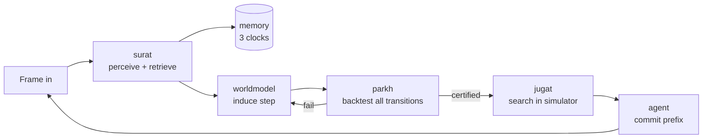

# SARBLOH — Agent Operating Spec

You are working inside SARBLOH, a competition and research repository targeting **ARC-AGI-3** (ARC Prize 2026).
This file is the contract. Read it fully before acting. It is authoritative over anything in `_archive/`.

---

## 1. Mission

Three outcomes, in priority order.

1. **Score.** Beat the open-weight field on ARC-AGI-3 under Kaggle's offline constraints.
2. **Evidence.** Produce a clean ablation showing the gain comes from the *memory architecture*, not the backbone model.
3. **Paper.** A submission to the ARC Prize paper track built from the experiment ledger, not written retroactively.

The thesis the repo exists to defend: **on an interactive benchmark scored by action efficiency, the binding constraint is memory and verification, not model intelligence.** The name states the rule — *sarbloh*, all-steel, no alloy: nothing unverified is admitted to the agent's semantic memory, and no uncertified world model is permitted to spend an environment action.

---

## 2. Hard competition facts

Verified against official sources on 2026-09-21. Re-verify anything marked UNCONFIRMED before relying on it.
Full snapshots live in `resources/official/`.

### Dates
| Gate | Date |
| --- | --- |
| ARC-AGI-3 Milestone Prize #2 (open-source) | 30 Sep 2026 |
| Final submission | **2 Nov 2026** |
| Paper track deadline | 8 Nov 2026 |
| Results announced | 4 Dec 2026 |

### Environment
- Observation: grid up to **64x64**, cell values **integers 0-15**, origin `(0,0)` top-left, `(x,y)` ordering.
- Actions: `GameAction` — ACTION1-ACTION4 directional, ACTION5 game-specific, ACTION6 complex (carries coordinate `data`). Docs also reference an undo action. **UNCONFIRMED:** the exact enum in the installed SDK version. Verify with `list(GameAction)` before writing any action logic and record the result here.
- `GameState`: WIN, GAME_OVER (plus in-progress states — verify against SDK).
- Observation payload: `FrameDataRaw` carrying `state`, `levels_completed`, and frame data.
- Environments are a series of levels. Early levels teach mechanics; later levels require composing them.

### Toolkit
- Package `arc-agi`, version **0.9.9** (2026-06-10), Python **>=3.12**, **MIT** licence.
- Entry point `Arcade`: `make()`, `get_environments()`, `get_scorecard()`, `create_scorecard()`, `close_scorecard()`, `listen_and_serve()`.
- `EnvironmentWrapper`: `observation_space`, `action_space`, `info`, `reset()`, `step(action, data, reasoning)`.
- Operation modes: **NORMAL** (local + API), **ONLINE** (API only), **OFFLINE** (local only), **COMPETITION**.
- Recordings written as JSONL.

**Consequence you must exploit:** `OFFLINE` mode drives local environments through the same interface as `COMPETITION`. Development against `eval/real_games/` and the real submission share one code path. Never write a second, dev-only agent loop.

### Scoring — RHAE
Relative Human Action Efficiency. The ratio of human to agent action count, **squared**, per level, weighted by level index, capped at 1.15x.

```latex
\text{RHAE}_{\text{level}} = \min\left(\left(\frac{a_{\text{human}}}{a_{\text{agent}}}\right)^2,\ 1.15\right)
```

Human baseline is the upper-median best human action count (third-best completer). It already includes human mechanics-discovery overhead.

**Two rules follow and they govern every design decision in this repo:**
1. **Reasoning is free, acting is not.** Internal deliberation, retrieval from the frame store, and simulated rollouts cost nothing against the metric. Only committed environment actions count. Push work out of the environment and into the model.
2. **Exploration cost dominates.** Paying twice for a fact already established is the primary loss term, and it is a memory failure by definition.

### Competition constraints
- **No internet access during Kaggle evaluation.** No API models. Local open weights only.
- **Solutions must complete within 12 hours on Kaggle.** (Not 9 — corrected 2026-09-21 from the ARC Prize testing policy.)
- **UNCONFIRMED:** exact Kaggle GPU allocation for this track. Verify on the competition's Code/Data tabs and record here.
- **All authored code must be open-sourced under a permissive licence** to be prize-eligible. Third-party code needs a licence permitting public sharing.
- Private evaluation environments are **out of distribution** — ARC Prize states limited mechanical overlap with the public set. Nothing about specific public mechanics can be memorised in advance.

### The field
| System | Model | Score | Verified |
| --- | --- | --- | --- |
| NVIDIA AVO | Opus 5 / GPT-5.6 Sol | 100.00 RHAE, public set | No |
| Schema (Impossible Research) | Opus 4.8 + Fable 5 | 98.98 RHAE, public set | No |
| VISTA | Opus 5.0 | 100.00 RHAE, public set | No |
| Executable World Models | GPT-5.5 High | 58.12 RHAE, 15/25 solved | Public set |
| **Tufa Labs "The Duck"** | **Qwen 3.6 27B FP8, local** | **Milestone #1, 1st** | **Yes, Kaggle offline** |

The last row is the comparison class. The rows above it used unbounded frontier inference on the contaminated public set. Do not cite them as targets; cite them as sources of mechanism.

---

## 3. Architecture



Every loop that does not reach `commit` costs zero RHAE. Maximise loops per committed action.

### Module contracts
| Module | Owns | Must never |
| --- | --- | --- |
| `sarbloh/surat` | Perception, frame store, retrieval. Lossless frames outside context, retrieved on request at frame/region/pixel granularity. | Hold history in the context window as its primary store |
| `sarbloh/memory` | Three clocks: frame-level episodic, level-level mechanics, environment-level procedures. Explicit promotion and eviction. | Promote anything that has not passed `parkh` |
| `sarbloh/worldmodel` | Inducing and refactoring an executable `step(state, action)`. | Be consulted for planning before certification |
| `sarbloh/parkh` | Exact replay of every recorded transition. Binary verdict. | Return partial credit unless an experiment explicitly tests that |
| `sarbloh/jugat` | Search inside the certified simulator; information-gain action selection. | Search against an uncertified model |
| `sarbloh/agent` | The loop, commitment policy, halt-on-misprediction, budget governor. | Commit more plan than the certification supports |
| `sarbloh/harness` | `Arcade` integration, Kaggle submission entry point, recording. | Contain agent logic |
| `sarbloh/legacy` | Pre-reorg monolithic agents, frozen. | Be imported by new code |

---

## 4. Working rules

These are not style preferences. Violating them destroys the paper and the YC evidence.

1. **Ledger obligation.** Every scored run appends one row to `history/ledger.jsonl` and one line to `history/LEDGER.md`: experiment id, hypothesis, config hash, git SHA, split, RHAE, delta vs baseline, verdict. A run that is not logged did not happen. No retroactive logging.
2. **Held-out protocol.** The split in `eval/splits/heldout_split.json` is frozen. Tune on the tune set. Report on the held-out set. **A gain that does not survive the split is noise and must be recorded as such, not quietly dropped.**
3. **No public-set tuning.** The public environments are contaminated and mechanically unrepresentative of the private set. Any change justified only by a public-set gain is a liability.
4. **Hypothesis before code.** Every experiment starts as `experiments/E###_name/hypothesis.md` stating the mechanism, the predicted effect, and the kill criterion. Then the code. Not the reverse.
5. **Kill criteria are binding.** If an experiment hits its stated kill criterion, it is killed and `verdict.md` records why. Extending a dead experiment is how six weeks disappear.
6. **Tests do not go to the archive.** If a test breaks, fix the test or fix the code. Moving it to `_archive/` is forbidden — that is precisely how this repo lost verifiability in August 2026.
7. **Mistakes log.** Anything that cost more than an hour goes in `planning/MISTAKES.md` with the cause, not just the symptom. Append-only.
8. **Resources carry provenance.** Every item under `resources/` has a sibling `.meta.yaml` with source URL, retrieval date, and one line on why it is here. No orphan PDFs.
9. **Never vendor third-party code into the package.** Clones live under `resources/repos/` and are gitignored. Licence compatibility is checked before any code is borrowed.
10. **Verify SDK facts against the installed SDK**, not against this file. Where they disagree, the SDK wins and this file gets corrected in the same commit.

---

## 5. Repo map

```
SARBLOH/
  CLAUDE.md           this file
  main.ipynb          driver: imports sarbloh/, runs eval, plots
  sarbloh/            the package
  eval/               scoring spine: official_score, bench, scoreboard, real_games, splits
  tests/              unit / component / regression
  experiments/        one dir per experiment, E### prefixed
  history/            LEDGER.md, ledger.jsonl, baselines.json
  planning/           ROADMAP.md, MISTAKES.md, decisions/ADR-*.md
  resources/          official/ papers/ repos/ web/ + INDEX.md
  runs/               traces, gitignored
  _archive/           frozen, read-only, not authoritative
```

## 6. Commands

```bash
python -m pytest tests/ -q                       # full suite
python -m eval.bench --agent sarbloh --split heldout
python -m eval.scoreboard                        # current standings
python -m eval.official_score <scorecard.json>   # official RHAE
```

---

*Last verified against official sources: 2026-09-21. Corrections go in the same commit as the code that found them.*
